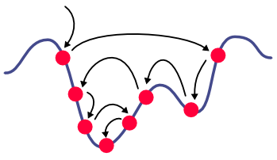

# `MHLib.jl` - A Toolbox for Metaheuristics and Hybrid Optimization Methods

_This project is still in early development, any feedback is much appreciated!_

`MHLib.jl` is a collection of modules, types, and functions  in Julia 1.8+ supporting
the effective implementation of metaheuristics and certain hybrid optimization approaches
for solving primarily combinatorial optimization problems.

Julia `MHLib.jl` emerged from the
[Python `mhlib`](https://github.com/ac-tuwien/pymhlib) and the older
[C++ `mhlib`](https://bitbucket.org/ads-tuwien/mhlib) to which it has certain similarities
but also many differences.

The main purpose of the library is to support rapid prototyping and teaching as well
as efficient implementations due to Julia's highly effective just-in-time-compilation.

`MHLib.jl` is developed primarily by the
[Algorithms and Complexity Group of TU Wien](https://www.ac.tuwien.ac.at),
Vienna, Austria, since 2020.

### Contributors:
- [Günther Raidl](https://www.ac.tuwien.ac.at/raidl) (primarily responsible)
- Nikolaus Frohner
- Thomas Jatschka
- Fabio Oberweger

## Installation

Major versions of `MHLib.jl` can be installed from the Julia REPL via

    ] add MHLib

Development versions are available at https://github.com/ac-tuwien/MHLib.jl and can be
installed via

    ] add https://github.com/ac-tuwien/MHLib.jl.git

## Major Components

Note that `MHLib.jl` is still behind the capabilities of the Python `pymhlib`, however, much more performant.

The main module provides the following types for candidate solutions and various
functions for them:
- `Solution`:
    An abstract type that represents a candidate solution to an optimization problem.
- `VectorSolution`:
    An abstract solution encoded by a vector of some user-provided type.
- `BoolVectorSolution`:
    An abstract solution encoded by a boolean vector.
- `PermutationSolution`:
    An abstract solution representing permutations of a fixed number of elements.
_ `SubsetVectorSolution`:
    A solution that is an arbitrary cardinality subset of a given set
    represented in vector form. The front part represents the selected
    elements, the back part optionally the unselected ones.

Moreover, the main module provides:
- `git_version()`:
    Function returning the abbreviated git version string of the current project.
- `settings`:
    Global settings that can be defined independently per module in a distributed
    way, while values for these parameters can be provided as program arguments or in
    configuration files. Most `pymhlib` modules rely on this mechanism for their external
    parameters.

Further modules:

- `Schedulers`, type `Scheduler`:
    A an abstract framework for single trajectory metaheuristics that rely on iteratively
    applying certain methods to a current solution.
    Modules like `GVNSs` and `LNSs` extend this type towards
    more specific metaheuristics.
- `GVNSs`, type `GVNSs`:
    A framework for local search, iterated local search, (general) variable neighborhood
    search, GRASP, etc.
- `LNSs`, type `LNS`:
    A framework for different variants of large neighborhood search (LNS).
    The selection of the destroy and repair methods is done in an extensible way by
    means of the abstract type `MethodSelector` and derived types in order to realize 
    different LNS variants.
- `ALNSs`, type `ALNS`:
    Adaptive large neighborhood search (ALNS). It is realized via `LNS` and 
    `ALNSMethodSelector`.

## Demos

For demonstration purposes subdirectory [`MHLibDemos`](MHLibDemos/README.md) provides a package (not officially registered at JuliaHub), with basic implementations for the following classical combinatorial optimization problems, to which some of MHLib's metaheuristics are applied:

- `OneMax`: basic test problem in which the goal is to set all digits in a binary
    string to `true`
- `GraphColoring`: graph coloring problem based on `VectorSolution`
- `MAXSAT`: maximum satisfiability problem based on `BinaryVectorSolution`
- `TSP`: traveling salesperson problem based on `PermutationSolution`
- `MKP`: multi-constrained knapsack problem based on `SubsetVectorSolution`
- `MISP`: maximum independent set problem based on `SubsetVectorSolution`

It is recommended to take the `MHLibDemos` package with one of the demos as template for 
solving your own problem.

Further smaller usage examples can also be found in the test directory of the main package.

## Parameter Tuning with SMAC3

Subdirectory `Tuning` contains examples on how SMAC3 can specifically be used for tuning
algorithms implemented in Julia. See [Tuning/README.md](Tuning/README.md) for details.

## News

See [CHANGELOG.md](CHANGELOG.md)

